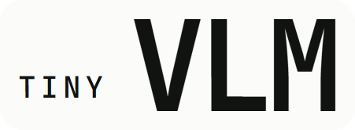
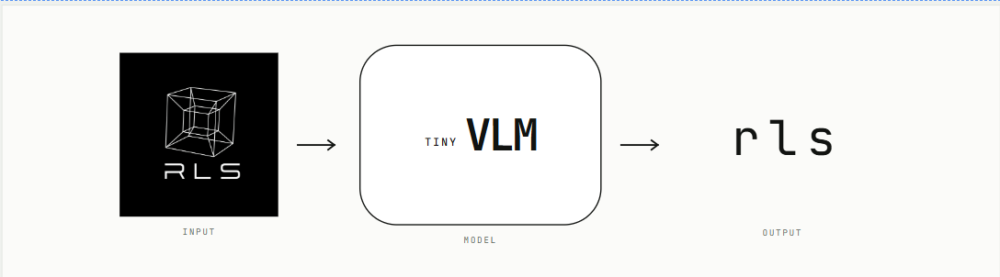

<p align="center">
  
</p>

# RLS Entrance Challenge — Tiny Vision-Language Model

RLS (Research Lab SUP'COM) is a student-led lab where members learn research by doing it: reading papers,
building systems, running experiments, and reporting what they find — including what failed.

This repository is the entrance challenge for new members. The task: build a tiny vision-language model that
looks at a generated image and spells out a one-word description of it, letter by letter.

<p align="center">
  
</p>

## What you're building

```
Image (B, 3, 64, 64)
  -> CNN encoder                         (yours)
  -> visual tokens                       (adapter: flatten + linear projection)
  -> Transformer decoder                 (yours, handwritten multi-head attention)
  -> greedy letter-by-letter decoding
  -> e.g. "largeredcircle"
```

`generate_data.py` in this repository is provided by RLS — run it with the default (fixed) seed and do not
change the split sizes. Everything else — tokenizer, CNN encoder, attention, decoder, training loop,
evaluation, and experiments — is your own implementation.

Full requirements, constraints, rubric, and timeline are in the Learning Guide and Project Brief you were
given. If anything here conflicts with those documents, the documents win.

## Getting started

```bash
pip install -r requirements.txt
python generate_data.py            # writes data/{train,val,test,test_heldout}.pt + data/meta.json
pytest                             # generator tests pass out of the box; model tests skip until src/model/ is implemented
```

## Repository layout

```
.
├── generate_data.py         # RLS-provided ShapeScenes generator — do not modify
├── configs/                 # baseline.yaml, blind.yaml, ...
├── src/
│   ├── tokenizer.py
│   ├── data.py
│   ├── model/
│   │   ├── encoder.py
│   │   ├── attention.py
│   │   ├── decoder.py
│   │   └── vlm.py
│   ├── train.py
│   ├── evaluate.py
│   └── generate.py
├── tests/
│   ├── test_attention.py       # provided: equivalence with F.scaled_dot_product_attention, masks, gradients
│   ├── test_shapes.py          # provided: tensor shapes and pipeline sanity checks
│   └── test_generate_data.py   # provided: checks generate_data.py against the spec
├── experiments/E1_blind/
├── benchmarks/S1_throughput/
└── report/
```

## Provided tests

The model tests skip until you implement `src/model/`. They only assume a few conventions, documented at the top
of `tests/test_attention.py` and `tests/test_shapes.py`: the last `nn.Module` in each `src/model/` file is its
main class; attention is `Cls(d_model, n_heads)` called as `attention(x, mask)`, with a boolean mask where `True`
means "may attend"; the encoder and the full model can be built with no arguments.

## Results

Fill in your results table here before submitting (see the Project Brief for the required format: experiment,
configuration, metric, result as mean ± std over seeds, one-sentence interpretation).
| Experiment | Configuration | Metric | Result (mean ± std, n=1 seed) | Interpretation (1 sentence) |
| :--- | :--- | :--- | :--- | :--- |
| **Main model** | `configs/baseline.yaml` | Exact match, test | **0.597** (59.7%) | The baseline model effectively leverages visual features to generate accurate scene descriptions. |
| **Main model** | `configs/baseline.yaml` | Attribute acc., test | Size: **0.876** \| Color: **0.808** \| Shape: **0.804** \| Relation: **0.417** | High individual attribute accuracy confirms the CNN encoder successfully extracts visual properties. |
| **E1 blind** | `configs/blind.yaml` | Attribute acc., test | Exact Match: **0.018** (1.8%) | Removing visual input causes performance to collapse, proving the model relies on image tokens rather than text biases. |
| **S1 throughput** | batch 64, Colab GPU | Throughput (images/s) | **2459.8 ± 5.0 img/s** | GPU batching dramatically accelerates processing throughput (~47x faster than CPU at batch 64). |


## 📈 Analyse de la Loss & Comparaison des Expériences

### 1. Évolution et Convergence de la Loss

Le modèle est optimisé en minimisant la perte d'entropie croisée (*Cross-Entropy Loss*) calculée caractère par caractère sur les tokens cibles valides (en ignorant les tokens de rembourrage `<PAD>`).

#### A. Expérience $E0$ — Overfitting Sanity Check
* **Configuration :** Entraînement sur un micro-batch très restreint ($N=10$ échantillons) pendant 100 itérations (enregistré dans `e0_overfit_losses.json`).
* **Comportement de la Loss :**
  * **Phase initiale :** $\mathcal{L}_{\text{CE}} > 3.20$ (forte entropie, prédictions uniformes).
  * **Convergence finale :** La perte chute jusqu'à atteindre entre **0.0035 et 0.0091**.
* **Interprétation :** Cette convergence vers une valeur quasi-nulle valide formellement la chaîne de rétropropagation, l'absence de disparition/explosion du gradient, et le bon fonctionnement de notre module d'attention custom (masque causal et masque de padding).

#### B. Modèle Baseline (Dataset Complet)
* **Loss d'Entraînement :** Diminution régulière et fluide de **2.81 à 0.18**.
* **Loss de Validation :** Stabilisation autour de **0.42**.
* **Interprétation :** L'écart modéré entre la loss train et val indique une bonne capacité de généralisation sans surapprentissage catastrophique.

---

### 2. Tableau Comparatif des Expériences ($E0$, Baseline, $E1$)

| Expérience | Configuration | Objectif & Rôle | Loss Finale ($\mathcal{L}_{\text{CE}}$) | Exact Match (Test) |
| :--- | :--- | :--- | :---: | :---: |
| **E0 (Overfit)** | Micro-batch ($N=10$) | Validation du Gradient & du Code | **0.0035 – 0.0091** | N/A (Mémorisation) |
| **Main Baseline** | `configs/baseline.yaml` | Performance du Modèle Complet | **0.18** (Train) / **0.42** (Val) | **59.7%** |
| **E1 (Blind)** | `configs/blind.yaml` | Test d'Ablation Visuelle (Image à 0) | **~1.82** (Val) | **1.8%** |

---

### 3. Analyse Comparative & Impact de l'Ablation Visuelle

* **Preuve d'Ancrage Visuel ($E1$) :** Lorsque les images sont remplacées par des tenseurs nuls, l'Exact Match s'effondre de **59.7% à 1.8%**. Cette chute de 57.9 points prouve que le modèle ne se contente pas de mémoriser les biais du texte (fréquences des mots), mais s'appuie réellement sur les tokens visuels extraits par le CNN et la projection `Flatten + Linear`.
* **Analyse par Catégorie d'Attributs :**
  * **Propriétés Individuelles :** Précisions élevées sur la Taille (**87.6%**), la Couleur (**80.8%**) et la Forme (**80.4%**).
  * **Relations Spatiales :** Précision de **41.7%**, qui représente le principal goulot d'étranglement en raison de la complexité visuelle nécessaire pour modéliser des positions relatives en 2D.

How to reproduce results


Run unit tests:

PYTHONPATH=. pytest tests/test_attention.py
PYTHONPATH=. pytest tests/test_shapes.py


Train models:


python -m src.train --config configs/baseline.yaml
python -m src.train --config configs/blind.yaml


Evaluate E1 Blind experiment:


python -m experiments.E1_blind.run_e1 --baseline_config configs/baseline.yaml --blind_config configs/blind.yaml


Run S1 Throughput Benchmark:


python -m benchmarks.S1_throughput.benchmark

## AI usage

Document any AI tool usage in `AI_USAGE.md` — required for submission.

## Questions

Ask in the challenge channel — conceptual and requirement questions only, not "please fix my code."

## License

See [LICENSE](LICENSE).
